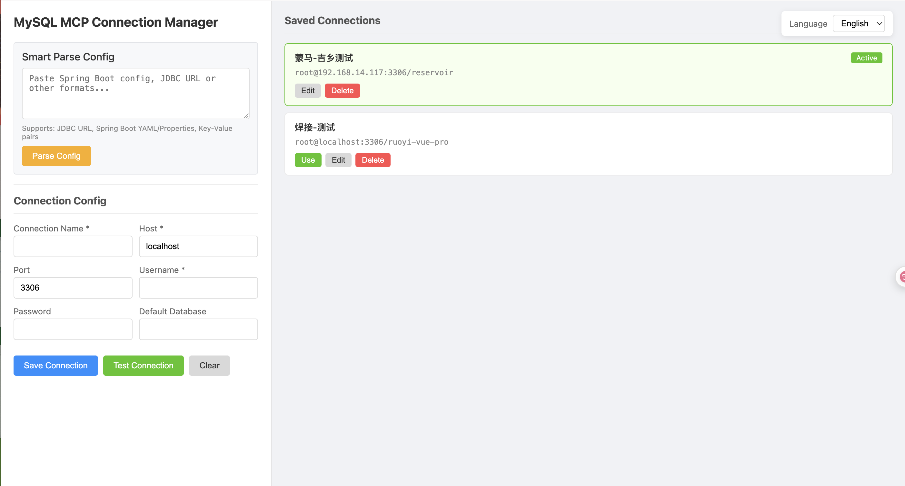
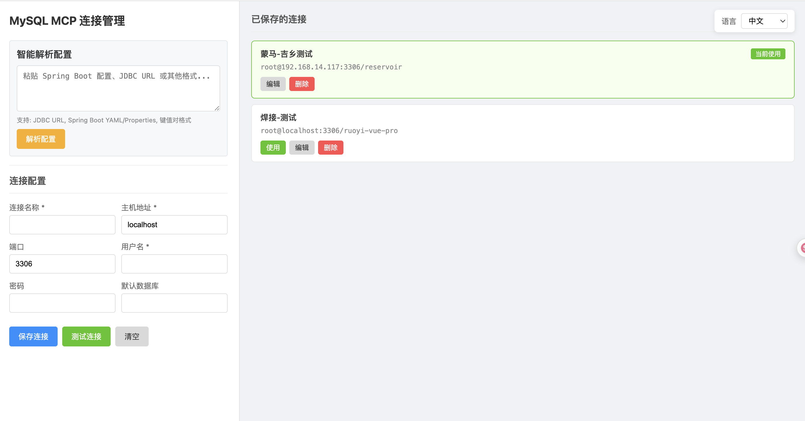

# MySQL MCP Server

[English](#english) | [中文](#中文)

[](https://opensource.org/licenses/MIT)
[](https://nodejs.org)
[](https://modelcontextprotocol.io)

---

<a name="english"></a>
## English

A powerful MySQL MCP (Model Context Protocol) server that enables AI assistants like Claude to interact with MySQL databases.

### Why This MCP Server?

Unlike other MySQL MCP servers, this project offers:

- **Web Management UI** - Visual interface to manage all your database connections
- **Real-time Connection Switching** - Switch between databases instantly without restarting
- **Smart Config Parsing** - Paste JDBC URL or Spring Boot config, auto-fill connection form
- **Secure Password Storage** - AES-256-GCM encrypted passwords
- **SQL Blacklist Protection** - Prevent dangerous SQL operations like DROP, TRUNCATE

### Screenshots

<!-- Add your screenshots here -->


### Acknowledgments

This project is inspired by and built upon [designcomputer/mysql_mcp_server](https://github.com/designcomputer/mysql_mcp_server). Special thanks to the original authors for their excellent work.

### Features

- **Full SQL Support**: SELECT, INSERT, UPDATE, DELETE, CREATE, ALTER, DROP
- **Database Management**: List databases, tables, describe table structures
- **Connection Management**: Save and switch between multiple database connections
- **SQL Blacklist**: Block dangerous SQL operations with customizable rules
- **Web UI**: Visual interface at `http://localhost:3456`
- **Secure Storage**: Passwords encrypted with AES-256-GCM
- **MCP Compatible**: Works with Claude Desktop and other MCP clients

### Installation

```bash
git clone https://github.com/minivv/mysql-mcp-server.git
cd mysql-mcp-server
npm install
npm run build
```

### Configuration

The server no longer requires a default database connection in environment variables.
Start the MCP server, open the Web UI, then add and activate your MySQL connection there.
Connections are saved in `~/.mysql-mcp/connections.json`.

#### Optional Environment Variables

```bash
MCP_WEB_PORT=3456              # Web UI port (default: 3456)
MCP_OPEN_BROWSER=false         # Disable auto-open browser (default: true)

# Optional legacy default connection fallback.
# If no Web UI connection is active, MYSQL_HOST and MYSQL_USER can still be used.
MYSQL_HOST=localhost
MYSQL_PORT=3306
MYSQL_USER=root
MYSQL_PASSWORD=your_password
MYSQL_DATABASE=your_database
```

#### Claude Desktop Configuration

**macOS**: `~/Library/Application Support/Claude/claude_desktop_config.json`
**Windows**: `%APPDATA%\Claude\claude_desktop_config.json`

```json
{
  "mcpServers": {
    "mysql": {
      "command": "node",
      "args": ["/path/to/mysql-mcp-server/build/index.js"],
      "env": {
        "MCP_OPEN_BROWSER": "false"
      }
    }
  }
}
```

### Available Tools

#### Query Tools

| Tool | Description |
|------|-------------|
| `run_sql_query` | Execute read-only queries (SELECT, SHOW, DESCRIBE, EXPLAIN) |
| `list_databases` | List all available databases |
| `list_tables` | List all tables in current database |
| `describe_table` | Show table structure |

#### Data Manipulation Tools

| Tool | Description |
|------|-------------|
| `create_table` | Create a new table |
| `insert_data` | Insert data into a table |
| `update_data` | Update existing data |
| `delete_data` | Delete data from a table |
| `execute_sql` | Execute any SQL statement (ALTER, DROP, etc.) |

#### Connection Management Tools

| Tool | Description |
|------|-------------|
| `switch_database` | Switch to a different database |
| `get_connection_info` | Get current connection information |
| `list_saved_connections` | List all saved connections |
| `save_connection` | Save a new connection |
| `use_connection` | Switch to a saved connection |
| `delete_connection` | Delete a saved connection |

### Web UI

The Web UI starts automatically with the MCP server at `http://localhost:3456`.
On first launch, add a connection and click **Use** before running database tools.

**Features:**
- Add/Edit/Delete database connections
- Test connection before saving
- One-click switch between connections
- Smart config parsing (JDBC URL, Spring Boot YAML/Properties)
- SQL Blacklist management with real-time testing

**Disable auto-open browser:**
```bash
MCP_OPEN_BROWSER=false
```

### Security

- Passwords are encrypted using AES-256-GCM
- Encryption key stored in `~/.mysql-mcp/.key` (mode 0600)
- Connection configs stored in `~/.mysql-mcp/connections.json`

### SQL Blacklist

The SQL Blacklist feature protects your database from dangerous operations. Manage it via Web UI or config file.

**Default blocked patterns:**

| Pattern | Description |
|---------|-------------|
| `DROP DATABASE` | Prevent database deletion |
| `DROP TABLE` | Prevent table deletion |
| `DROP INDEX` | Prevent index deletion |
| `TRUNCATE` | Prevent table truncation |
| `DELETE without WHERE` | Prevent full table deletion |
| `UPDATE without WHERE` | Prevent full table update |
| `ALTER TABLE DROP` | Prevent column deletion |
| `GRANT / REVOKE` | Prevent permission changes |

**Configuration file:** `~/.mysql-mcp/sql-blacklist.json`

**Features:**
- Enable/disable globally or per-rule
- Add custom regex patterns
- Test SQL statements in real-time
- Reset to defaults anytime

### Contributing

Contributions are welcome! Please feel free to submit a Pull Request.

### License

MIT License - see [LICENSE](LICENSE) for details.

---

<a name="中文"></a>
## 中文

一个功能强大的 MySQL MCP (Model Context Protocol) 服务器，让 Claude 等 AI 助手能够与 MySQL 数据库进行交互。

### 为什么选择这个 MCP 服务器？

与其他 MySQL MCP 服务器不同，本项目提供：

- **Web 管理界面** - 可视化管理所有数据库连接
- **实时切换连接** - 无需重启即可在不同数据库间切换
- **智能配置解析** - 粘贴 JDBC URL 或 Spring Boot 配置，自动填充表单
- **安全密码存储** - 使用 AES-256-GCM 加密存储密码
- **SQL 黑名单保护** - 防止 DROP、TRUNCATE 等危险 SQL 操作

### 截图

<!-- 在此添加截图 -->


### 致谢

本项目基于 [designcomputer/mysql_mcp_server](https://github.com/designcomputer/mysql_mcp_server) 开发，特别感谢原作者的优秀工作。

### 功能特性

- **完整 SQL 支持**: SELECT, INSERT, UPDATE, DELETE, CREATE, ALTER, DROP
- **数据库管理**: 列出数据库、表，查看表结构
- **连接管理**: 保存和切换多个数据库连接
- **SQL 黑名单**: 可自定义规则拦截危险 SQL 操作
- **Web 界面**: 可视化管理界面 `http://localhost:3456`
- **安全存储**: 密码使用 AES-256-GCM 加密
- **MCP 兼容**: 支持 Claude Desktop 和其他 MCP 客户端

### 安装

```bash
git clone https://github.com/minivv/mysql-mcp-server.git
cd mysql-mcp-server
npm install
npm run build
```

### 配置

现在不再需要通过环境变量配置默认数据库连接。
启动 MCP 服务器后，打开 Web 界面，在页面中添加并启用 MySQL 连接即可。
连接配置会保存到 `~/.mysql-mcp/connections.json`。

#### 可选环境变量

```bash
MCP_WEB_PORT=3456              # Web 界面端口 (默认: 3456)
MCP_OPEN_BROWSER=false         # 禁用自动打开浏览器 (默认: true)

# 可选：兼容旧版默认连接配置。
# 如果 Web 界面中没有启用连接，仍可通过 MYSQL_HOST 和 MYSQL_USER 提供默认连接。
MYSQL_HOST=localhost
MYSQL_PORT=3306
MYSQL_USER=root
MYSQL_PASSWORD=your_password
MYSQL_DATABASE=your_database
```

#### Claude Desktop 配置

**macOS**: `~/Library/Application Support/Claude/claude_desktop_config.json`
**Windows**: `%APPDATA%\Claude\claude_desktop_config.json`

```json
{
  "mcpServers": {
    "mysql": {
      "command": "node",
      "args": ["/path/to/mysql-mcp-server/build/index.js"],
      "env": {
        "MCP_OPEN_BROWSER": "false"
      }
    }
  }
}
```

### 可用工具

#### 查询工具

| 工具 | 描述 |
|------|------|
| `run_sql_query` | 执行只读查询 (SELECT, SHOW, DESCRIBE, EXPLAIN) |
| `list_databases` | 列出所有数据库 |
| `list_tables` | 列出当前数据库的所有表 |
| `describe_table` | 查看表结构 |

#### 数据操作工具

| 工具 | 描述 |
|------|------|
| `create_table` | 创建新表 |
| `insert_data` | 插入数据 |
| `update_data` | 更新数据 |
| `delete_data` | 删除数据 |
| `execute_sql` | 执行任意 SQL (ALTER, DROP 等) |

#### 连接管理工具

| 工具 | 描述 |
|------|------|
| `switch_database` | 切换数据库 |
| `get_connection_info` | 获取当前连接信息 |
| `list_saved_connections` | 列出已保存的连接 |
| `save_connection` | 保存新连接 |
| `use_connection` | 切换到已保存的连接 |
| `delete_connection` | 删除已保存的连接 |

### Web 管理界面

Web 界面随 MCP 服务器自动启动，访问 `http://localhost:3456`。
首次启动时，先添加连接并点击**使用**，再运行数据库工具。

**功能：**
- 添加/编辑/删除数据库连接
- 测试连接可用性
- 一键切换活动连接
- 智能配置解析 (JDBC URL, Spring Boot YAML/Properties)
- SQL 黑名单管理，支持实时测试

**禁用自动打开浏览器：**
```bash
MCP_OPEN_BROWSER=false
```

### 安全性

- 密码使用 AES-256-GCM 加密存储
- 加密密钥保存在 `~/.mysql-mcp/.key` (权限 0600)
- 连接配置保存在 `~/.mysql-mcp/connections.json`

### SQL 黑名单

SQL 黑名单功能可保护数据库免受危险操作。通过 Web 界面或配置文件管理。

**默认拦截规则：**

| 规则 | 描述 |
|------|------|
| `DROP DATABASE` | 禁止删除数据库 |
| `DROP TABLE` | 禁止删除表 |
| `DROP INDEX` | 禁止删除索引 |
| `TRUNCATE` | 禁止清空表 |
| `DELETE 无 WHERE` | 禁止无条件删除 |
| `UPDATE 无 WHERE` | 禁止无条件更新 |
| `ALTER TABLE DROP` | 禁止删除列 |
| `GRANT / REVOKE` | 禁止权限变更 |

**配置文件：** `~/.mysql-mcp/sql-blacklist.json`

**功能特点：**
- 支持全局或单条规则启用/禁用
- 支持自定义正则表达式规则
- 支持实时测试 SQL 语句
- 支持一键恢复默认规则

### 贡献

欢迎贡献代码！请随时提交 Pull Request。

### 许可证

MIT 许可证 - 详见 [LICENSE](LICENSE) 文件。
